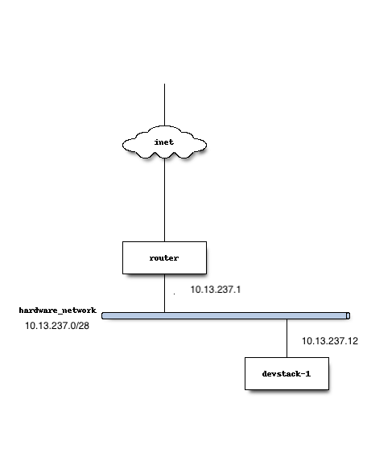
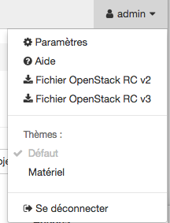

https://docs.openstack.org/devstack/latest/guides/single-machine.html

 PREREQUIS: s'assurer que /etc/resolv.conf est protégé et que le DNS reste accéssible


## Installation shake and bake

* Ajouter l'utilisateur `stack`

```
$ sudo useradd -s /bin/bash -d /opt/stack -m stack
```

* Comme l'utilisateur fera des modifications a votre systeme, il devra avoir des droits speciaux:

```
$ echo "stack ALL=(ALL) NOPASSWD: ALL" | sudo tee /etc/sudoers.d/stack
```

* Se Logger en tant qu'utilisateur `stack`

```
$ sudo su - stack
```

* Telecharger la derniere version de DevStack

```
$ sudo apt-get install git -y || sudo yum install -y git
$ git clone --single-branch -b stable/queens https://git.openstack.org/openstack-dev/devstack
$ cd devstack
```

# Configuration 

* Editer le fichier local.conf

https://docs.openstack.org/devstack/latest/guides/neutron.html



** Using Neutron with a Single Interface

```
[[local|localrc]]
HOST_IP=10.13.237.17
SERVICE_HOST=10.13.237.17
MYSQL_HOST=10.13.237.17
RABBIT_HOST=10.13.237.17
GLANCE_HOSTPORT=10.13.237.17:9292
ADMIN_PASSWORD=secret
DATABASE_PASSWORD=secret
RABBIT_PASSWORD=secret
SERVICE_PASSWORD=secret

## Neutron options
Q_USE_SECGROUP=True
FLOATING_RANGE="10.13.237.16/28"
IPV4_ADDRS_SAFE_TO_USE="10.0.0.0/22"
Q_FLOATING_ALLOCATION_POOL=start=10.13.237.20,end=10.13.237.30
PUBLIC_NETWORK_GATEWAY="10.13.237.1"
PUBLIC_INTERFACE=enp3s0f0

# Open vSwitch provider networking configuration
Q_USE_PROVIDERNET_FOR_PUBLIC=True
OVS_PHYSICAL_BRIDGE=br-ex
PUBLIC_BRIDGE=br-ex
OVS_BRIDGE_MAPPINGS=public:br-ex

FORCE=yes
```

## Manipulation manuelle (non testee)

* permet le kernel forwarding

```
$ sudo sysctl -w net.ipv4.ip_forward=1
```

* ajout manuel d'une interface reseau

```
sudo ip addr flush dev br-ex
sudo ip addr add 10.13.237.10/28 dev br-ex
sudo ip link set br-ex up
sudo route add -net 10.0.0.0/22 gw 10.13.237.10
```


https://docs.openstack.org/devstack/latest/guides/multinode-lab.html

** Multi-Node Lab

```
[[local|localrc]]
FLOATING_RANGE=10.13.237.16/28
FIXED_RANGE=172.16.0.0/24
FIXED_NETWORK_SIZE=256
FLAT_INTERFACE=enp10s0

ADMIN_PASSWORD=supersecret
DATABASE_PASSWORD=$ADMIN_PASSWORD
RABBIT_PASSWORD=$ADMIN_PASSWORD
SERVICE_PASSWORD=$ADMIN_PASSWORD
```


Faire tourner l'installation de DevStack:

```
./stack.sh
```

### apres 40 minutes

```
=========================
DevStack Component Timing
 (times are in seconds)  
=========================
run_process           27
test_with_retry        3
apt-get-update         2
osc                  187
wait_for_service      23
git_timed            209
dbsync               194
pip_install          538
apt-get              515
-------------------------
Unaccounted time     720
=========================
Total runtime        2418


This is your host IP address: 10.13.237.12
This is your host IPv6 address: ::1
Horizon is now available at http://10.13.237.12/dashboard
Keystone is serving at http://10.13.237.12/identity/
The default users are: admin and demo
The password: secret

WARNING: 
Using lib/neutron-legacy is deprecated, and it will be removed in the future


Services are running under systemd unit files.
For more information see: 
https://docs.openstack.org/devstack/latest/systemd.html

DevStack Version: queens
Change: 935ae3f73ab14643b9d07722ee8262ba55e1edd8 Merge "Fix TEMPEST_AUTH_VERSION comparision condition for identity v2" into stable/queens 2018-08-14 01:28:16 +0000
OS Version: Ubuntu 18.04 bionic

2018-08-25 19:10:10.779 | stack.sh completed in 2418 seconds.
```

# Tester son environmment

* telecharger le fichier `openrc`. Selectionner la version 3 =>  `Fichier OpenStack RC v3`



* `sourcer` le fichier telecharge (i.e. demo-openrc.sh)

```
$ source ~/demo-openrc.sh
```

* Tester une commande

```
$ openstack user list
```

* Installer `precise` Ubuntu 14.04 LTS (marche)

```
$ cd /run/shm  
$ wget https://cloud-images.ubuntu.com/precise/current/precise-server-cloudimg-amd64-disk1.img
$ glance image-create --name "Ubuntu-14.04 LTS" --disk-format qcow2 --container-format bare --progress --file /run/shm/precise-server-cloudimg-amd64-disk1.img
```

* Installer `xenial` Ubuntu 16.04 LTS (ne marche pas)

```
$ cd /run/shm
$ wget https://cloud-images.ubuntu.com/xenial/current/xenial-server-cloudimg-amd64-disk1.img
$ glance image-create --name "Ubuntu-16.04 LTS" --disk-format qcow2 --container-format bare --progress --file /run/shm/xenial-server-cloudimg-amd64-disk1.img
```

# Arreter et supprimer Devstack

* Arreter et supprimer

```
$ cd ~devstack
$ ./unstack.sh
$ ./clean.sh
```
* le rendre tres propre

```
$ cd ~
$ sudo rm -rf * # Enleve aussi Devstack
$ rm -rf .* # Enleve les fichiers de configurations
$ sudo reboot
```
Attendre 5 minutes de reboot


# Utilitaires

## systemd

* Liste des services géré par `systemd`

```
$ sudo  service --status-all
 [ + ]  apache-htcacheclean
 [ + ]  apache2
 [ + ]  apparmor
 [ + ]  conntrackd
 [ - ]  console-setup.sh
 [ + ]  cron
```

* Le statut d'un service en particulier

```
$ sudo service rabbitmq-server status
● rabbitmq-server.service - RabbitMQ Messaging Server
   Loaded: loaded (/lib/systemd/system/rabbitmq-server.service; enabled; vendor preset: enabled)
   Active: active (running) since Fri 2018-08-24 19:06:52 EDT; 14h ago
 Main PID: 11374 (rabbitmq-server)
    Tasks: 308 (limit: 4915)
   CGroup: /system.slice/rabbitmq-server.service
           ├─11374 /bin/sh /usr/sbin/rabbitmq-server
           ├─11383 /bin/sh /usr/lib/rabbitmq/bin/rabbitmq-server
           ├─11545 /usr/lib/erlang/erts-9.2/bin/epmd -daemon
           ├─11710 /usr/lib/erlang/erts-9.2/bin/beam.smp -W w -A 256 -P 1048576 -t 5000000 -stbt db -zdbbl 32000 -K true -B i -- -root /usr/lib/erlang -progname erl -- -home /var/lib/rabbitmq -- -pa /usr/lib/rabbitmq/lib/rabbitmq_server-3.6.10/
           ├─12038 erl_child_setup 65536
           ├─12157 inet_gethost 4
           └─12158 inet_gethost 4
```

* redemarrer les services

```
sudo service rabbitmq-server start
sudo service mysql start
sudo service apache2 start
```
