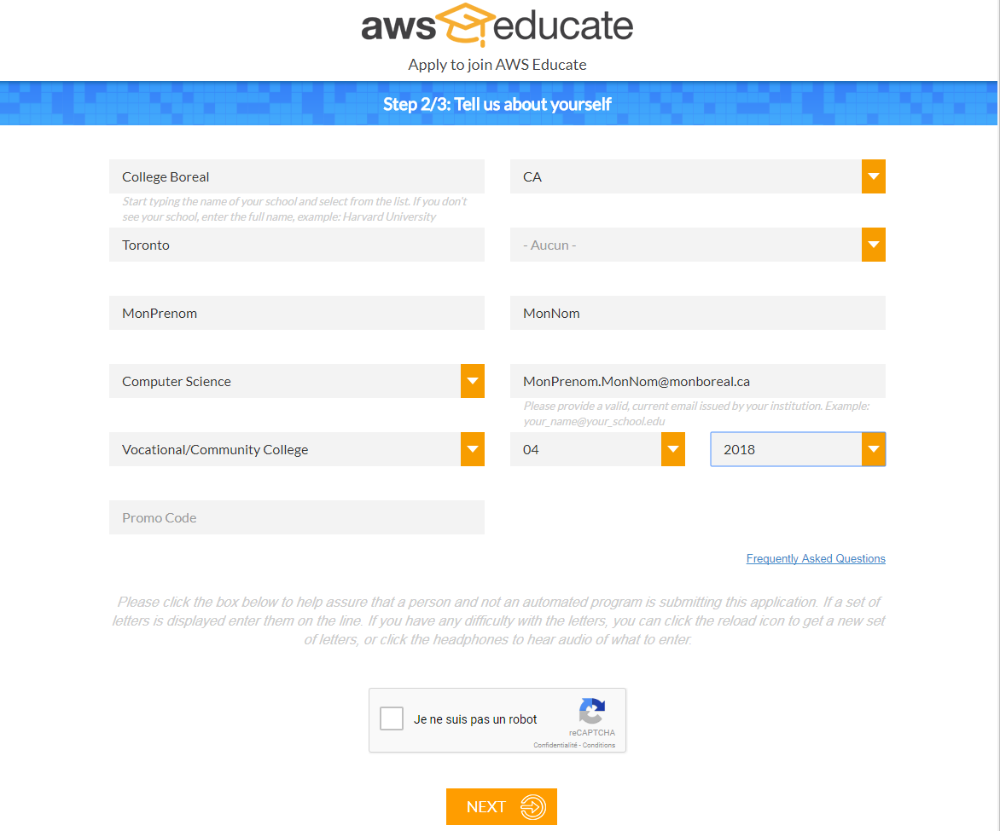
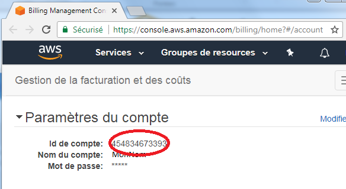

# AWS (Amazon Web Services)

## Créer un compte AWS Educate

https://aws.amazon.com/fr/education/awseducate/

* Suivre les instructions de remplissage d'utilisateurs de type `Étudiants`  
* Remplir la forme ci-dessous selon le modèle



* Pour `étudiants`, créer le compte avec le courriel `@monboreal.ca`  
* Pour `professeurs`, créer le compte avec le courriel `@collegeboreal.ca`  
* Pour ID du compte:  rechercher l'information dans votre compte `AWS Tableau de Bord`



## Se connecter à AWS Educate

https://www.awseducate.com/SiteLogin


# AWS Deploiement

### Docker Machine AWS

#### Installer Docker-Machine 
https://docs.docker.com/machine/install-machine/

#### appliquer vos identifiants
~/.aws/credentials
```
[default]
    aws_access_key_id = <me remplir>
    aws_secret_access_key = <me remplir>
```

#### Lancer une nouvelle machine

par défaut (t2.micro)
```
$ docker-machine create --driver amazonec2  \
                        --amazonec2-security-group monGroupe \
                        maVM
```

Avec une instance plus large
```
$ docker-machine create --driver amazonec2  \ 
                        --amazonec2-instance-type t2.micro \
                        --amazonec2-security-group monGroupe maVM
```

Avec un sous-réseau
```
$ docker-machine create --driver amazonec2 \
                        --amazonec2-vpc-id vpc-yyyy \
                        --amazonec2-subnet-id subnet-yyyy \
                        --amazonec2-zone b \
                        maVM
```


